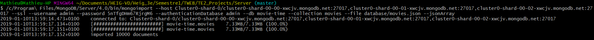

# TWEB TE2

author: Mathieu Jee

date: January 2019


## Choix d'implémentation

J'ai choisi d'implémenter la partie `backend`.


## Serveur (Backend)

database importée: 




Créer un utilisateur: http://localhost:5000/graphql

query: 

```
query {
	createUser(username: "toto", password: "toto") {
    username
  }
}
```


Tests unitaires (bidons) implémentés dans la partie client.


## Client

J'ai un mini client avec uniquement un processus d'authentification et des tests unitaires sur un *component* bidon.

Repo client: https://github.com/mathieujee/TWEB_TE2_Client


